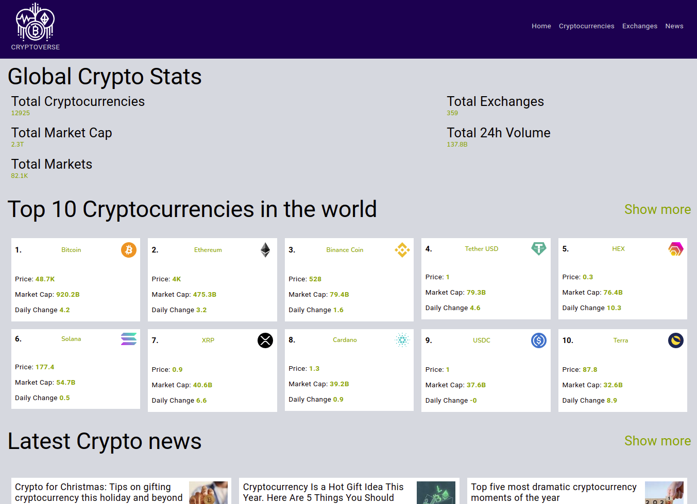

### CryptoVerse tudo sobre Crypto moedas.

## About The Project

This project developed by me is inspired by the Crypto Verse app created by [JavaScript Master](https://www.youtube.com/watch?v=9DDX3US3kss&t=25s) on youtube, I used the video only as a wireframe.
All code in this repository is my authority.
### Built With

This section should list any major frameworks/libraries used to bootstrap your project. Leave any add-ons/plugins for the acknowledgements section. Here are a few examples.

* [React.js](https://reactjs.org/)
* [Redux](https://react-redux.js.org/)
* [SASS](https://sass-lang.com/)
* [Node.js](https://nodejs.org/en/)
* [chart.js](https://www.chartjs.org/)
* [React Router v6](https://reactrouter.com/docs/en/v6/getting-started/overview)
* [Figma](https://www.figma.com/)
## Contact

Nicolas Johns - [Linkedin](https://www.linkedin.com/in/nicolas-js/) - nicolas-sousa2011@hotmail.com

Project Link: [repo-link](https://gxxxxxx)

## Acknowledgments
* [Rapid API](https://rapidapi.com/hub?utm_source=youtube.com%2FJavaScriptMastery&utm_medium=DevRel&utm_campaign=DevRel)
* [Coinranking API](https://rapidapi.com/Coinranking/api/coinranking1?utm_source=youtube.com%2FJavaScriptMastery&utm_medium=DevRel&utm_campaign=DevRel)
* [Bing News search](https://rapidapi.com/microsoft-azure-org-microsoft-cognitive-services/api/bing-news-search1?utm_source=youtube.com%2FJavaScriptMastery&utm_medium=DevRel&utm_campaign=DevRel)
* [Heroku](https://dashboard.heroku.com/apps)
* [Google Fonts](https://fonts.google.com/)
* [React Icons](https://react-icons.github.io/react-icons/search)
* [JavaScript Master](https://www.youtube.com/watch?v=9DDX3US3kss&t=25s)
